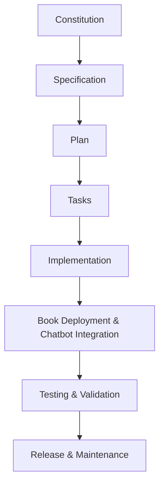

# SP.Constitution - Physical AI & Humanoid Robotics Textbook Project

## Project Mission
Create an accessible, technically accurate, and interactive textbook that bridges the gap between digital AI and physical robotics, enabling students to apply AI knowledge to control humanoid robots in simulated and real-world environments.

## Core Values
- **Accessibility**: Content must be beginner-friendly while remaining technically rigorous
- **Accuracy**: All technical information must be verified against official documentation
- **Practicality**: Theory must be paired with executable, tested examples
- **Inclusivity**: Support multiple languages and learning styles
- **Quality**: All components must meet professional standards

## Quality Standards

### 1. Clarity & Accessibility
- **Beginner-Friendly Explanations**:
  - Use analogies and step-by-step breakdowns for complex concepts
  - Define all technical terms on first use
  - Include prerequisite knowledge indicators for each module
- **Multi-Device Support**:
  - UI must be responsive and readable on desktop, tablet, and mobile
  - Font sizes must be adjustable (minimum 14px base, scalable to 200%)
  - Navigation must work with keyboard and screen readers
- **Progressive Disclosure**:
  - Start with simple concepts, gradually introduce complexity
  - Provide "Quick Start" guides for each module
  - Include "Advanced Topics" sections for deeper exploration

### 2. Technical Accuracy
- **Code Verification**:
  - All code examples must be executable and tested against official SDKs
  - Python examples must comply with PEP 8 standards
  - ROS 2 code must be compatible with latest stable distribution
  - Isaac ROS examples must match current NVIDIA documentation
- **Documentation Standards**:
  - Include version numbers for all dependencies
  - Provide clear setup instructions for each environment
  - Document expected behavior and common troubleshooting steps
- **Verification Process**:
  - Code examples must run successfully in both simulation and real hardware (where applicable)
  - All examples must include expected output or behavior

### 3. Completeness
- **Module Requirements**:
  - Each module must include: Theory, Practical Examples, Exercises, and Assessment
  - Minimum 2 executable examples per module
  - Include both basic and advanced use cases
  - Provide complete, runnable projects for each concept
- **Content Structure**:
  - Clear learning objectives at the start of each chapter
  - Summary and key takeaways at the end
  - Cross-references to related concepts
  - Links to official documentation and resources

### 4. Functional RAG Integration
- **Accuracy Standards**:
  - Chatbot answers must be grounded in textbook content
  - Provide citations to specific chapters, sections, or pages
  - Accuracy rate must be ≥95% for factual questions
  - Include confidence scores for uncertain answers
- **Response Quality**:
  - Answers must be comprehensive yet concise
  - Include relevant code snippets when appropriate
  - Provide step-by-step guidance for procedural questions
  - Acknowledge limitations when information is not in the knowledge base
- **Testing Requirements**:
  - Chatbot must correctly answer ≥5 diverse questions per module
  - Responses must be consistent across multiple queries
  - Include examples and practical applications in answers

### 5. Code Quality
- **Python Standards**:
  - PEP 8 compliance for all Python code
  - Type hints for all function signatures
  - Proper error handling and logging
  - Comprehensive docstrings following Google style
- **FastAPI Backend**:
  - All endpoints must be tested with pytest
  - Response time must be <3 seconds for 95% of requests
  - Proper authentication and authorization implemented
  - Rate limiting to prevent abuse
- **ROS 2 Integration**:
  - Proper node lifecycle management
  - Correct use of topics, services, and actions
  - Appropriate message types and serialization
  - Error handling for connection failures

### 6. Interactive Learning
- **Visual Elements**:
  - All diagrams must be clear, properly labeled, and accessible
  - Mermaid/ASCII diagrams must render correctly in all formats
  - Interactive elements must work across all supported devices
  - Include alt text for all visual content
- **Engagement Features**:
  - Code playgrounds for immediate experimentation
  - Step-by-step interactive tutorials
  - Progress tracking and achievement badges
  - Hands-on projects with submission capability

### 7. User Experience
- **Interface Design**:
  - Clean, intuitive navigation structure
  - Consistent visual design across all pages
  - Fast loading times (≤3 seconds for initial load)
  - Offline capability for core content
- **Accessibility**:
  - WCAG 2.1 AA compliance
  - Keyboard navigation support
  - Screen reader compatibility
  - High contrast mode option
- **Performance**:
  - Optimized images and assets
  - Efficient data loading and caching
  - Minimal third-party dependencies

### 8. Personalization
- **User Profiles**:
  - Learning progress tracking
  - Customizable difficulty levels
  - Preferred learning paths
  - Bookmark and note-taking capabilities
- **Adaptive Content**:
  - Adjust content based on user skill level
  - Recommend relevant modules and exercises
  - Track learning preferences and adapt accordingly

### 9. Urdu Translation
- **Translation Quality**:
  - High accuracy with technical terminology consistency
  - Cultural appropriateness for Urdu-speaking audience
  - Fast response times (≤2 seconds additional latency)
  - Maintain code examples in English with translated explanations
- **Implementation**:
  - Real-time translation capability
  - Language preference persistence
  - Mixed-language support for technical terms
  - Translation quality verification process

### 10. Deployment Requirements
- **Frontend**:
  - Web-accessible with responsive design
  - Progressive Web App (PWA) capabilities
  - CDN distribution for global access
  - SSL/TLS encryption enabled
- **Backend**:
  - FastAPI server with proper monitoring
  - Database integration (Neon) with backup
  - Vector store (Qdrant) for RAG functionality
  - Auto-scaling based on load
- **Infrastructure**:
  - 99.9% uptime SLA
  - Disaster recovery procedures
  - Regular security updates
  - Performance monitoring and alerting

## Success Criteria (Measurable)

### Content Completion
- [ ] All 4 modules completed with ≥2 executable examples each
- [ ] Capstone project fully implemented and tested
- [ ] Total of ≥20 practical examples across all modules
- [ ] Assessment questions for each chapter (≥5 per chapter)

### Technical Performance
- [ ] Chatbot answers ≥5 diverse questions per module accurately
- [ ] Website renders correctly on all target devices
- [ ] Page load times ≤3 seconds for 95% of requests
- [ ] All diagrams and flowcharts render correctly
- [ ] FastAPI endpoints respond in <3 seconds (95th percentile)

### Feature Implementation
- [ ] Personalization features fully functional
- [ ] Urdu translation service operational
- [ ] RAG chatbot integrated and tested
- [ ] Interactive elements working across all modules
- [ ] User progress tracking implemented

### Quality Assurance
- [ ] All code examples tested and verified
- [ ] Accessibility compliance validated
- [ ] Cross-browser compatibility confirmed
- [ ] Security vulnerabilities addressed
- [ ] Performance benchmarks met

## Technical Standards

### Documentation Format
- Markdown with syntax-highlighted code blocks
- Mermaid diagrams for flowcharts and system architecture
- ASCII diagrams as fallback for complex visualizations
- Consistent formatting and style guide adherence

### Development Workflow
- Follow Spec-Driven Development (SDD) methodology
- Constitution → Specification → Plan → Tasks → Implementation
- All changes must reference specific requirements
- Test-driven development for all code components

### Testing Requirements
- Unit tests for all backend endpoints
- Integration tests for RAG functionality
- End-to-end tests for user workflows
- Performance tests for response times
- Accessibility tests for UI components

### Version Control
- Git workflow with feature branches
- Pull requests with code review
- Semantic versioning for releases
- Changelog maintenance

## Workflow Diagram

## Governance
- Regular review of constitution (quarterly)
- Updates require team consensus
- Changes must maintain backward compatibility where possible
- All contributors must acknowledge constitution before contributing

## Risk Management
- Technical debt monitoring
- Security vulnerability scanning
- Performance degradation alerts
- Content accuracy verification processes

## Measurement & Validation
- All standards must be measurable and testable
- Automated testing for code quality and performance
- User feedback integration for content improvement
- Regular audits against constitution requirements

---
*This constitution serves as the foundational document for all project decisions and implementations.*

**Version**: 1.0.0 | **Ratified**: 2025-12-10 | **Last Amended**: 2025-12-10
